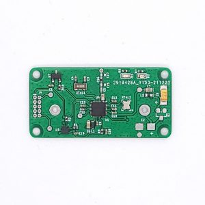
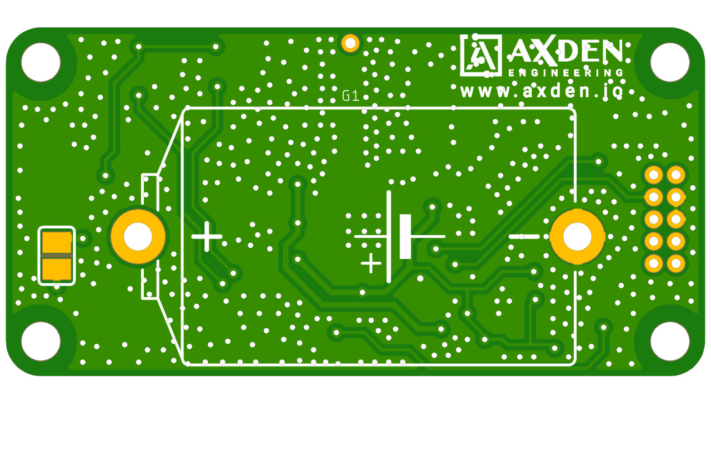
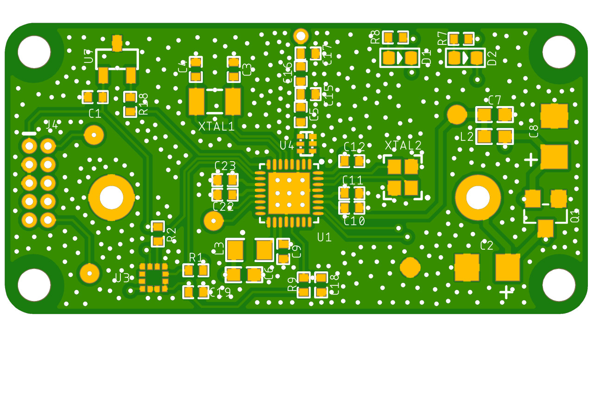

# 3-Axis Sub-G LongRang Motion Tracker


<br>

----

3-Axis Sub-G LongRang Motion Tracker 은 가속도센서를 이용하여 Motion Tracker 에 필요한 핵심적인 정보를 수집하고 Sub-G 통신을 이용하여 전송합니다.
<br>
1Km 이상의 장거리 통신이 필요한 다양한 서비스 시나리오를 빠르게 테스트 할 수 있도록 제공하는 예제입니다.
<br>
<br>
3-Axis Sub-G LongRang Motion Tracker collects essential information required for Motion Tracker by using accelerometer and transmits it using Sub-G communication.
<br>
This is an example that provides quick testing of various service scenarios that require long-distance communication of 1Km or more.
<br>

----

[네이버 스마트 스토어](https://smartstore.naver.com/axden)
<br>

----

### 주요 특징 및 기능

MCU | 설명
:-------------------------:|:-------------------------:
CC1310 | Sub-G SoC

센서 | 설명
:-------------------------:|:-------------------------:
KXTJ3 | 3 Axis Accelerometer
Si7201 | Hall Sensor
Battery | 1/2 AA Battery 1200mAh

<br>

Sub-G 통신이 가능한 Motion tracker 입니다.
<br>

CC1310 SoC 를 이용하여 Sub-G 통신이 가능합니다.
<br>

SI7201 Hall 센서와 자석을 이용하여 On Off 할 수 있습니다.
<br>

KXTJ3 을 이용하여 가속도 값을 수집합니다.
<br>

배터리를 이용하여 5년동안 사용 가능합니다.
<br>

----

### Note

해당 프로그램으로 예제 프로그램으로 양산 및 상용화에 적합하지 않습니다.
<br>

양산 및 대량 구매 고객께서는 development@axden.io 으로 문의 주시기 바랍니다.
<br>

양산 및 대량 구매 고객분들께는 Ti SC 를 이용한 저전력, 안정화, 게이트웨이와 통신 등 사용하시는 목적에 맞는 최적화된 Firmware 를 무료로 개발해 드립니다.
<br>

<table>
  <tr align="center">
    <td>Top</td>
    <td>Bottom</td>
  </tr>
  <tr align="center">
    <td></td>
    <td></td>
  </tr>
</table>

Pinmap 은 ```board_define.h``` 파일에서 확인 가능합니다.
<br>

```

#define LED_RED_GPIO IOID_8
#define LED_BLUE_GPIO IOID_9

#define HALL_SENSOR_GPIO IOID_0

#define I2C_SDA IOID_1
#define I2C_SCL IOID_2


```

Sub-G 통신 관련 설정은 ```RadioTask.c``` 파일에서 확인 가능합니다.
<br>

```

EasyLink_Params easyLink_params;
EasyLink_Params_init(&easyLink_params);
easyLink_params.ui32ModType = EasyLink_Phy_5kbpsSlLr;

if (EasyLink_init(&easyLink_params) != EasyLink_Status_Success)
{

    SysCtrlSystemReset();

}

EasyLink_getIeeeAddr(mac_address);

if (EasyLink_setFrequency(920000000) != EasyLink_Status_Success)
{

    SysCtrlSystemReset();

}

if (EasyLink_enableRxAddrFilter(mac_address, 8, 1)
        != EasyLink_Status_Success)
{

    SysCtrlSystemReset();

}

radio_packet_protocol.Packet.company_id[0] = COMPANY_ID >> 8;
radio_packet_protocol.Packet.company_id[1] = COMPANY_ID;

radio_packet_protocol.Packet.device_id[0] = DEVICE_TYPE >> 8;
radio_packet_protocol.Packet.device_id[1] = DEVICE_TYPE;

memcpy(radio_packet_protocol.Packet.mac_address, mac_address, 8);

radio_packet_protocol.Packet.control_number = 0;

SensorTask_registerPacketSendRequestCallback(sendPacketCallback);

while (1)
{

    Semaphore_pend(radioAccessSemHandle, BIOS_WAIT_FOREVER);

    EasyLink_setRfPower(TX_POWER);

    radio_sensor_data_packet_send(radio_packet_protocol);

    uint32_t events = Event_pend(radioEventHandle, 0,
    RADIO_TASK_EVENT_ALL,
                                 BIOS_WAIT_FOREVER);

    if (events == RADIO_TASK_EVENT_ACK)
    {

        recv_error_count = 0;

    }
    else if (events == RADIO_TASK_EVENT_ACK_TIMEOUT)
    {

        recv_error_count += 1;

        if (recv_error_count > RECV_ERROR_MAX_COUNT)
        {

            collection_cycle_timeout_count += 3;
            recv_error_count = 0;

        }

    }

}


```
